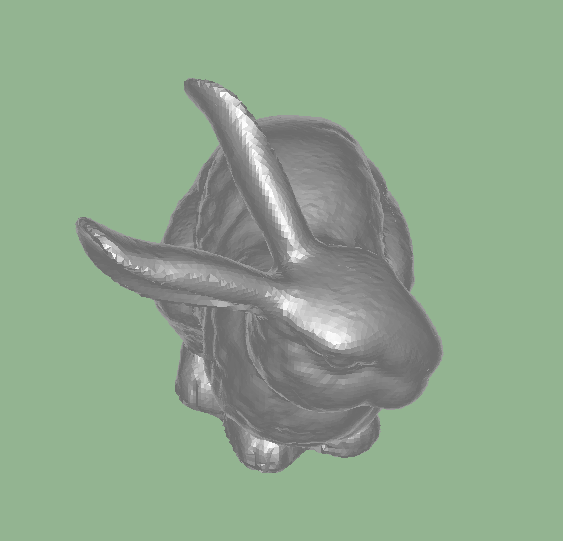

# 区间扫描线Z缓冲算法

## 环境

| 环境 |  |
|--|--|
| OS | Windows10 pro 1709 |
| IDE | Visual Studio 2017 Community |
| 工具集 | v141 |
| WindowsSDK版本 | 10.0.15063.0 |

## 编译链接选项

| 选项 |  |
|--|--|
| 平台 | x64 |
| 配置 | Release |
| 优化 | 速度最大(O2) |
| 指令增强 | AVX2 |
| 浮点模型 | 快速(fast) |
| 堆内存优化 | TCMalloc |

## 绘制框架

利用Win32API管理一块绘制屏幕大小的内存区域作为帧缓存，绘制结束后将这块内存区域复制到窗口对应的句柄内显示

## 绘制流水

读入的obj文件包含了所有顶点的坐标，以及所有面片的顶点索引，并支持obj格式的面片分组

1. 数据结构建立
    1. 对每一个多边形面片，计算相机空间内的坐标，与屏幕上的坐标
    1. 将该多边形加入多边形表，根据光照计算颜色
    1. 对多边形的每一条边，加入边表
1. 逐扫描线操作，从下至上扫描
    1. 把该行的边加入活化边表
    1. 活化边表排序
    1. 对每个扫描线区间，找到离视点最近的多边形，若没有多边形则返回-1
    1. 更新活化多边形表，在表中搜索区间右侧边所在多边形，如果已在表内，则移出表；若不在表内，则加入表
    1. 更新活化边表，每条边的x按dx递增，y加1，同时删除扫描完成的边

## 使用

### 模型导入

```c++
    p_model_ = new FileReader::ObjModel();
    p_model_->readObj("models/2.obj");
```

在第二行中修改需要读取的模型的名字，所得的模型经过平移和缩放的正则化操作，使其顶点坐标的平均值为(0, 0, 0)并且其都分布在边长为25的立方体内(25是根据相机，投影等参数而定的值)

### 交互方式

模型空间到世界空间的变换为一个SO3矩阵，运行期可通过方向键修改其旋转，旋转用yzy的欧拉角来描述，左右方向键控制第一个y的旋转，上下方向键控制z的旋转

鼠标滚轮可控制相机距世界坐标(0, 0, 0)的距离

## 数据结构

### 数学用数据结构

#### 顶点

`Vector3d`：三维欧氏空间内的一个点，实现了基本的四则运算；内外积；取模；归一化操作

`Vector4d`：三维齐次空间内的一个点，用于整合平移操作，以及投影变换。能与`Vector3d`相互转化。

#### 变换矩阵

`Matrix44d`：4X4的齐次变换矩阵。`Vector4d`为列向量，因此在计算时矩阵在左侧，并提供了按行构造矩阵的构造函数。

### OBJ模型

```c++
class ObjModel
{
    std::string m_path;// 路径
    std::vector<Math::Vector3d> m_vertices;// 点集
    std::vector<ObjTriangle> m_triangles;// 三角形面片集
    std::map<std::string, ObjGroup> m_groups;// 面片分组
}
```

三角形面片用顶点索引来表示，分别记录每个顶点在点集中的索引

```c++
struct ObjTriangle
{
    PWint m_vertexIndex[3];
};
```

面片组记录了三角形面片的索引，表示那些三角形属于该组

```c++
struct ObjGroup
{
    std::vector<PWint> m_triangleIndices;
};
```

绘制的时候，首先遍历该模型的所有面片组；对每一组，遍历其下每一三角形；每一三角形通过索引确定特定的顶点，进行相关计算

    OBJ格式的模型用"f v1 v2 v3 v4 ..."的方式按顺序记录每一个多边形的顶点，读取的时候按照凸多边形的方式，使用扇形结构存储为三角形"(v1 v2 v3) (v1 v3 v4) ..."。存储为三角形后多边形内的所有逐顶点操作就可以展开为分别处理3个顶点，而原始多边形的存储方式由于顶点数未知不能做循环展开，对性能有一定影响。polygon分支里实现了直接处理多边形的方式，可实现凹多边形的绘制。如果采用多边形方式实现，ObjTriangle替换为ObjPolygon，并用vector记录所有顶点的索引。绘制的时候最终能和三角形的方式统一到一个顶点列表中。

### 区间扫描线

#### 屏幕空间边的描述

```c++
struct EdgeNode
{
    PWint m_ymax;// 表示上端点的y值
    PWint m_y;// 下端点的y值，在活化边表中表示扫描线的y值
    PWdouble m_x;// 下端点的x值，在活化边表中表示和扫描线的交点的x值
    PWdouble m_dx;// 每移动一条扫描线x的增加量
    PWint m_polygonId;// 该边所在的多边形索引
};
```

#### 屏幕空间多边形描述

```c++
struct PolygonNode
{
    PWint m_id;// 多边形索引
    PWdouble m_a, m_b, m_c, m_d;//屏幕空间的平面方程，用于计算扫描区间的z值
    Math::Vector3d m_color;// 多边形的颜色，光栅化时进行光照计算得到最终颜色
};
```

#### 边表

每一扫描线的边表，用连续内存的表记录

`using EdgeTable = std::vector<EdgeNode>;`

整个屏幕的边表，用行号为索引，记录改行的扫描线边表，该简单线性表未使用STL容器

`EdgeTable* p_et_`

活化边表为了快速增删节点使用list作为存储结构

`using ActiveEdgeTable = std::list<EdgeNode>;`

#### 多边形表

记录所有多边形，用vector方便随机访问

`using PolygonTable = std::vector<PolygonNode>;`

#### 活化多边形表

记录的是多边形的索引，为了方便增删使用list

`using InPolygonTable = std::list<PWint>;`

## 相关优化

### 编译器优化

O2编译优化，fast浮点以精度为代价提高浮点运算速度，AVX2指令集加速

### 裁剪优化

1. 相机空间的坐标点左乘投影矩阵后得到w非1的齐次空间中的坐标点，其中z>0的部分在摄像机后面。一个多边形面片只要有一个顶点在相机后面则认为不可见，直接剔除。
1. 在w已为1的屏幕空间上，根据多边形的顶点可计算屏幕空间下的法向量，若法向量的z值为负，说明其与视线方向相同，该面为背面，直接剔除。
1. 远近平面裁剪：
    - 若多边形以三角形的方式存储，对于三角形在远近平面外的部分做裁剪，将三角形面片裁剪为多边形使剩余部分在裁剪立方体内，裁剪之后三角形会变成一个用顶点列表表示的多边形
    - 若维持原多边形的顶点方式存储，不裁剪，但是会做剔除，其形式本身就是顶点列表
1. 检查xy两个维度的包围盒，剔除包围盒完全在裁剪立方体外的部分。
1. 对边表中的每一条边，用裁剪立方体进行裁剪

### 其它

1. 活化边表因为只有顺序访问且要频繁增删，使用list替代vector
1. 多边形去掉了in/out的flag，而活化多边形表记录了覆盖了当前区间的多边形，每个区间都有多边形被移除活化表或加入活化表，用list提高插入、删除效率
1. 因为大量使用了STL容器，且存在频繁内存分配，需要用户态和内核态频繁切换，因此使用了TCMalloc加速分配内存

## 结果

测试环境下CPU为i7-6700k，频率4.3GHz，单线程

绘制屏幕大小为`1600*900`

模型为69452三角形面片的兔子模型

| 选项 | 频率 |
|--|--|
| Debug non-TCMalloc Triangle | 0.3Hz |
| Release TCMalloc Triangle | 50Hz |
| Release TCMalloc Polygon | 36Hz |

结果图像



可以处理深度信息
